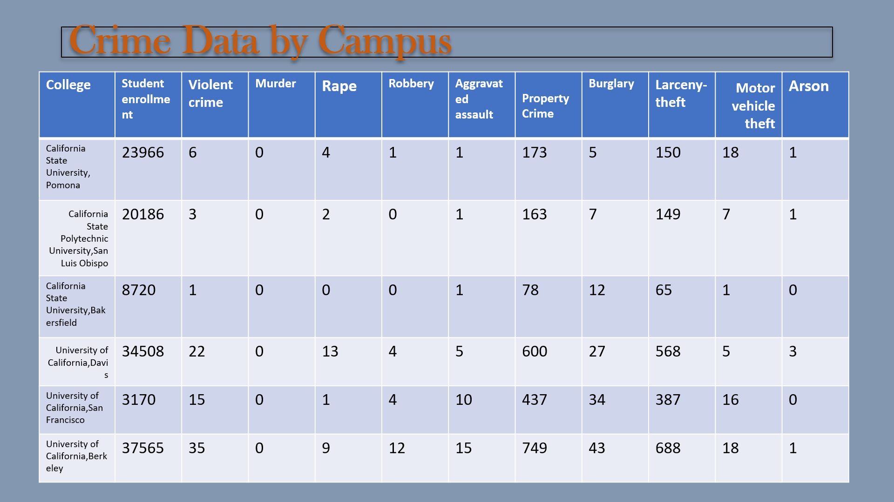

# Crime-Statistics-and-Weather-Correaltion
Crime statistics and weather. 
Is there a correlation between crime and the weather?
In this project we gathered crime data from various UC campuses and analyze the data to see if there were any trends. 

First step was to clean and organize the crime datasets using Python and Pandas as shown below. After we cleaned the weather data, narrowed down the time and dates of both weather and crime on UC campuses, and analyzed that data from there. 

